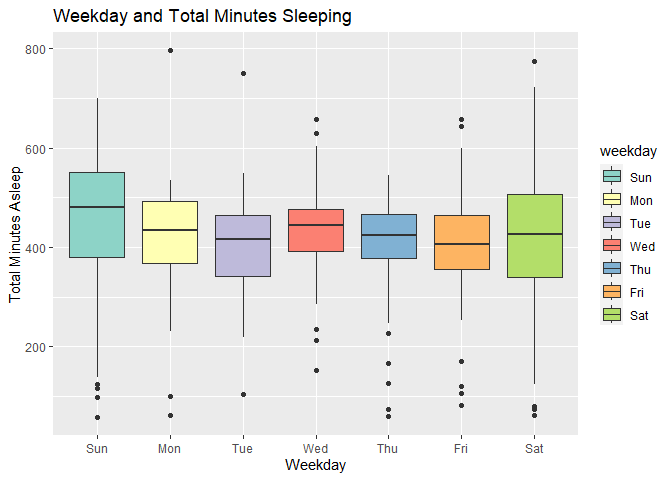
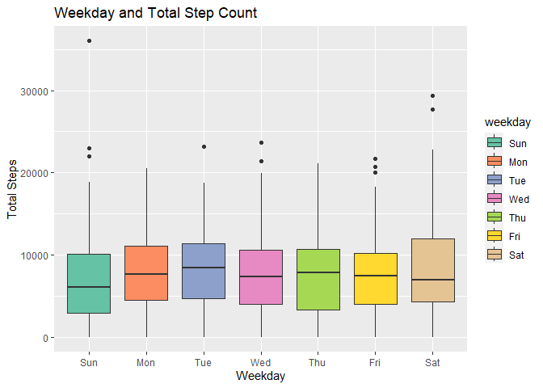
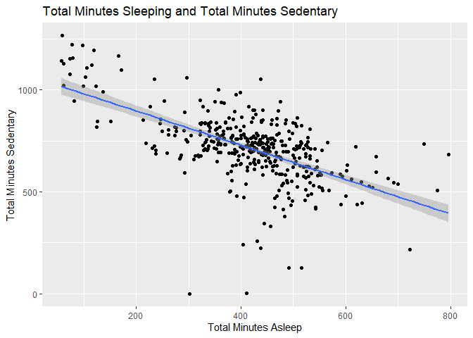
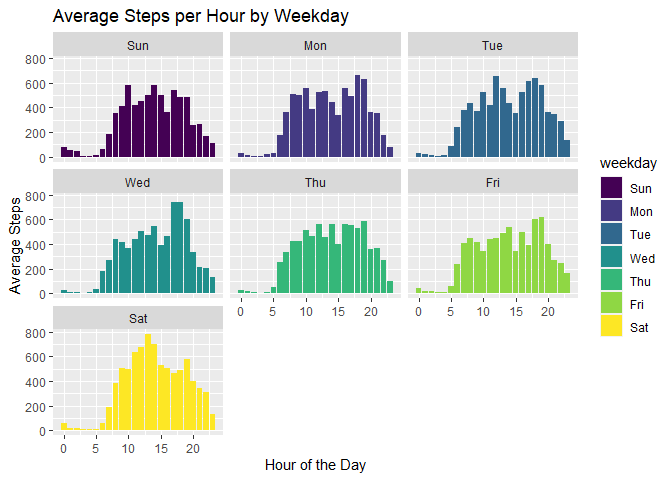
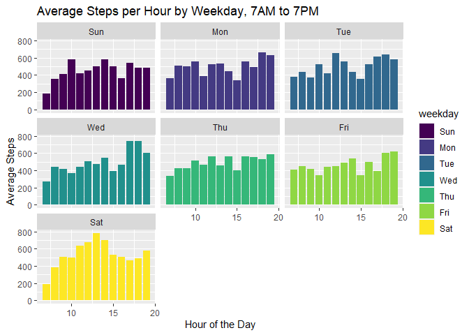

Bellabeat Case Study
================
Rachel Zhang
2023-08-02

## **Introduction**

> This case study aims to use public data on smart device users’ daily
> habits in order to discover consumer trends and advise *Bellabeat*’s
> marketing strategy.

Founded in 2013 by Urška Sršen and Sando Mur, *Bellabeat* is a high-tech
company that manufactures health-focused smart products for women. Some
of their products include:

- **Bellabeat App**: The Bellabeat app provides users with health data
  related to their activity, sleep, stress, menstrual cycle, and
  mindfulness habits.
- **Leaf**: Bellabeat’s classic wellness tracker can be worn as a
  bracelet, necklace, or clip. The Leaf tracker connects to the
  Bellabeat app to track activity, sleep, and stress.
- **Time**: This wellness watch combines the timeless look of a classic
  timepiece with smart technology to track user activity, sleep, and
  stress. The Time watch connects to the Bellabeat app to provide you
  with insights into your daily wellness.
- **Spring**: This is a water bottle that tracks daily water intake
  using smart technology to ensure that you are appropriately hydrated
  throughout the day.

The dataset consists of personal tracker data from 30 eligible Fitbit
users, which includes minute-level output for physical activity, heart
rate, and sleep monitoring. Following the analysis of the data, I will
use my findings to provide a few recommendations for Bellabeat’s
products and marketing.

#### I will center this analysis on data from three spreadsheets within the dataset: daily activity, daily sleep, and hourly step count.

``` r
# Import necessary packages

library(tidyverse) #Includes ggplot2, dplyr, readr, tibble, tidyr, stringr
library(lubridate) #For formatting dates
library(RColorBrewer) #For color palettes in graphs
```

``` r
# Import all csv files

activity_df <- read_csv("dailyActivity_merged.csv") #daily activity in minutes
hourly_steps_df <- read_csv("hourlySteps_merged.csv") #hourly step count
sleep_df <- read_csv("sleepDay_merged.csv") #daily sleep in minutes
```

``` r
# Ensure that data has been imported correctly:

head(activity_df)
```

    ## # A tibble: 6 × 15
    ##       Id Activ…¹ Total…² Total…³ Track…⁴ Logge…⁵ VeryA…⁶ Moder…⁷ Light…⁸ Seden…⁹
    ##    <dbl> <chr>     <dbl>   <dbl>   <dbl>   <dbl>   <dbl>   <dbl>   <dbl>   <dbl>
    ## 1 1.50e9 4/12/2…   13162    8.5     8.5        0    1.88   0.550    6.06       0
    ## 2 1.50e9 4/13/2…   10735    6.97    6.97       0    1.57   0.690    4.71       0
    ## 3 1.50e9 4/14/2…   10460    6.74    6.74       0    2.44   0.400    3.91       0
    ## 4 1.50e9 4/15/2…    9762    6.28    6.28       0    2.14   1.26     2.83       0
    ## 5 1.50e9 4/16/2…   12669    8.16    8.16       0    2.71   0.410    5.04       0
    ## 6 1.50e9 4/17/2…    9705    6.48    6.48       0    3.19   0.780    2.51       0
    ## # … with 5 more variables: VeryActiveMinutes <dbl>, FairlyActiveMinutes <dbl>,
    ## #   LightlyActiveMinutes <dbl>, SedentaryMinutes <dbl>, Calories <dbl>, and
    ## #   abbreviated variable names ¹​ActivityDate, ²​TotalSteps, ³​TotalDistance,
    ## #   ⁴​TrackerDistance, ⁵​LoggedActivitiesDistance, ⁶​VeryActiveDistance,
    ## #   ⁷​ModeratelyActiveDistance, ⁸​LightActiveDistance, ⁹​SedentaryActiveDistance

``` r
head(hourly_steps_df)
```

    ## # A tibble: 6 × 3
    ##           Id ActivityHour          StepTotal
    ##        <dbl> <chr>                     <dbl>
    ## 1 1503960366 4/12/2016 12:00:00 AM       373
    ## 2 1503960366 4/12/2016 1:00:00 AM        160
    ## 3 1503960366 4/12/2016 2:00:00 AM        151
    ## 4 1503960366 4/12/2016 3:00:00 AM          0
    ## 5 1503960366 4/12/2016 4:00:00 AM          0
    ## 6 1503960366 4/12/2016 5:00:00 AM          0

``` r
head(sleep_df)
```

    ## # A tibble: 6 × 5
    ##           Id SleepDay              TotalSleepRecords TotalMinutesAsleep TotalT…¹
    ##        <dbl> <chr>                             <dbl>              <dbl>    <dbl>
    ## 1 1503960366 4/12/2016 12:00:00 AM                 1                327      346
    ## 2 1503960366 4/13/2016 12:00:00 AM                 2                384      407
    ## 3 1503960366 4/15/2016 12:00:00 AM                 1                412      442
    ## 4 1503960366 4/16/2016 12:00:00 AM                 2                340      367
    ## 5 1503960366 4/17/2016 12:00:00 AM                 1                700      712
    ## 6 1503960366 4/19/2016 12:00:00 AM                 1                304      320
    ## # … with abbreviated variable name ¹​TotalTimeInBed

## **Data Cleaning and Formatting**

``` r
# Nice! Now let's start cleaning. Let's check for duplicates and na values from our dataframes
# First check for na values:

any(is.na(activity_df))
```

    ## [1] FALSE

``` r
any(is.na(hourly_steps_df))
```

    ## [1] FALSE

``` r
any(is.na(sleep_df))
```

    ## [1] FALSE

``` r
# Great! No na values for any of them. 
# Now check for duplicates:

any(duplicated(activity_df))
```

    ## [1] FALSE

``` r
any(duplicated(hourly_steps_df))
```

    ## [1] FALSE

``` r
any(duplicated(sleep_df))
```

    ## [1] TRUE

``` r
# Drop the duplicates from sleep file:

sleep_df <- sleep_df %>%
  distinct() %>%
  drop_na()

# Verify that duplicates are removed:
any(duplicated(sleep_df))
```

    ## [1] FALSE

``` r
# For the purpose of later analyses, I'll create some new variables within the dataframes

# First, within the hourly steps dataframe, I'll make a new variable that stores the weekday from each date, and another variable that stores the hour

hourly_steps_df$weekday <- wday(mdy_hms(hourly_steps_df$ActivityHour), label=TRUE)#stores weekday from the date log
hourly_steps_df$hour <- hour(mdy_hms(hourly_steps_df$ActivityHour))

head(hourly_steps_df)
```

    ## # A tibble: 6 × 5
    ##           Id ActivityHour          StepTotal weekday  hour
    ##        <dbl> <chr>                     <dbl> <ord>   <int>
    ## 1 1503960366 4/12/2016 12:00:00 AM       373 Tue         0
    ## 2 1503960366 4/12/2016 1:00:00 AM        160 Tue         1
    ## 3 1503960366 4/12/2016 2:00:00 AM        151 Tue         2
    ## 4 1503960366 4/12/2016 3:00:00 AM          0 Tue         3
    ## 5 1503960366 4/12/2016 4:00:00 AM          0 Tue         4
    ## 6 1503960366 4/12/2016 5:00:00 AM          0 Tue         5

``` r
# Next, I'll also create another weekday variable in the sleep and activity dataframes, and change the current date variable to show only date and no time since the time is the same for every entry

sleep_df$SleepDay <- as.Date(mdy_hms(sleep_df$SleepDay))#convert date to just month day year
sleep_df$weekday <- wday(sleep_df$SleepDay, label = TRUE)

activity_df$ActivityDate<- as.Date(activity_df$ActivityDate, format = "%m/%d/%Y")#changes activity date to year month day format 
activity_df$weekday <- wday(activity_df$ActivityDate, label = TRUE)
```

``` r
# I'll also make a new dataframe for one of my analyses that needs variables from two dataframes
# Perform an inner join on the sleep and activity dataframes. 
sleep_df <- rename(sleep_df, Date = SleepDay)
activity_df <- rename(activity_df, Date = ActivityDate)

merged_activity_sleep <- merge(sleep_df, activity_df, by=c("Id","Date")) 
```

## **Analysis**

#### **Weekday and Total Minutes Sleeping**

First, let’s examine the relationship between weekday and total minutes
spent sleeping through a group boxplot

``` r
weekday_sleep_plot <- ggplot(sleep_df, aes(x = weekday, y = TotalMinutesAsleep))
weekday_sleep_plot + geom_boxplot(aes(fill = weekday))+scale_fill_brewer(palette="Set3")+labs(title = "Weekday and Total Minutes Sleeping", x = "Weekday", y = "Total Minutes Asleep") 
```

<!-- -->

From the visualization, we can see that Sunday has the highest median
minutes asleep, while Friday has the lowest average minutes asleep.
Saturday and Sunday also have the largest ranges of sleep time, ranging
from under 200 minutes(3 hours) to over 600 minutes(10 hours). This
clearly shows how work schedules can have a significant effect on sleep.
People tend to maintain consistent sleep on work days (Mon-Fri) with low
variation, and then either spent weekends sleeping significantly
more(likely “catching up on sleep”) or less for nighttime activities.
Let’s also look at the average total minutes sleeping for each weekday:

``` r
sleep_summary <- sleep_df %>%
  group_by(weekday) %>%
  summarise(mean_value = mean(TotalMinutesAsleep,na.rm=TRUE))

sleep_summary
```

    ## # A tibble: 7 × 2
    ##   weekday mean_value
    ##   <ord>        <dbl>
    ## 1 Sun           453.
    ## 2 Mon           420.
    ## 3 Tue           405.
    ## 4 Wed           435.
    ## 5 Thu           401.
    ## 6 Fri           405.
    ## 7 Sat           419.

The CDC recommends that adults 18-60 years sleep at least 7 hours per
night. However, it appears that from our dataset the individuals do not
get an average of at least 7 hours of sleep on any days except Wednesday
and Sunday.

#### **Weekday vs. Total Steps**

Similar to the first plot, a group boxplot is helpful to see the
distribution of total steps for each weekday.

``` r
weekday_step_plot <- ggplot(activity_df, aes(x = weekday, y = TotalSteps))
weekday_step_plot + geom_boxplot(aes(fill = weekday))+scale_fill_brewer(palette="Set2")+labs(title = "Weekday and Total Step Count", x = "Weekday", y = "Total Steps")
```

<!-- -->

Sunday has the smallest median for total steps. This corresponds to what
we found in the other plot: because people tend to sleep more on
Sundays, it can cause lower overall step count. Saturdays also appear to
have the highest variance, and we can confirm that different weekend
activities may cause differing activity levels.

We can also look at the average total steps for each weekday:

``` r
step_summary <- activity_df %>%
  group_by(weekday) %>%
  summarise(mean_value = mean(TotalSteps,na.rm=TRUE))

step_summary
```

    ## # A tibble: 7 × 2
    ##   weekday mean_value
    ##   <ord>        <dbl>
    ## 1 Sun          6933.
    ## 2 Mon          7781.
    ## 3 Tue          8125.
    ## 4 Wed          7559.
    ## 5 Thu          7406.
    ## 6 Fri          7448.
    ## 7 Sat          8153.

It is recommended that people walk at least 10,000 steps per day,
however none of the weekdays have an average step count that reaches
10,000.

#### **Total Minutes Sleeping and Total Minutes Sedentary**

Next, let’s look at the relationship between two variables from our
merged sleep and activity dataframe: total minutes sleeping and total
minutes sedentary(seated, inactive).

``` r
sleeping_sedentary_plot <- ggplot(merged_activity_sleep, aes(x = TotalMinutesAsleep, y = SedentaryMinutes))
sleeping_sedentary_plot + geom_point() + geom_smooth(method = "lm")+labs(title = "Total Minutes Sleeping and Total Minutes Sedentary", x = "Total Minutes Asleep", y = "Total Minutes Sedentary")
```

<!-- -->

``` r
cor(merged_activity_sleep$TotalMinutesAsleep,merged_activity_sleep$SedentaryMinutes) #calculate correlation coefficient
```

    ## [1] -0.6010731

There appears to be a moderately strong negative correlation between
total minutes asleep and total minutes sedentary. As people spend more
time asleep, they tend to spend less time sedentary throughout the day.

#### **Hour of Day and Average Number of Steps**

This time, we’ll use a group of bar charts to look at average number of
steps per hour, for each weekday.

``` r
df_avg <- hourly_steps_df %>%
  group_by(weekday, hour) %>%
  summarise(avg_steps = mean(StepTotal, na.rm = TRUE))

# Create the bar chart
ggplot(df_avg, aes(x = hour, y = avg_steps, fill = weekday)) +
  geom_bar(stat = "identity", position = "dodge") +
  facet_wrap(~ weekday) +
  labs(x = "Hour of the Day", y = "Average Steps", title = "Average Steps per Hour by Weekday")
```

<!-- -->

From this distribution, because the average steps for 8pm-6am are
significantly less than the other hours, let’s narrow down the hours
displayed in the bar charts to get a closer look into the more active
hours.

``` r
df_filtered <- hourly_steps_df %>%
  filter(hour>6 & hour<20)
df_avg <- df_filtered %>%
  group_by(weekday, hour) %>%
  summarise(avg_steps = mean(StepTotal, na.rm = TRUE))

# Create the bar chart
ggplot(df_avg, aes(x = hour, y = avg_steps, fill = weekday)) +
  geom_bar(stat = "identity", position = "dodge") +
  facet_wrap(~ weekday) +
  labs(x = "Hour of the Day", y = "Average Steps", title = "Average Steps per Hour by Weekday, 7AM to 7PM")
```

<!-- -->

Overall, we can see that people have the most steps per hour on
Saturdays, while for other weekdays step count tends to be a lot lower.
There tends to be an increase in average step count 11AM-2PM, which
could be due to people moving around for lunch time, and 5-7PM for
dinner time.

## **Summary**

From our analyses, we discovered some important findings:

- For each weekday, participants had an average of 6.68-7.53 hours of
  sleep. For only two of those weekdays did the average surpass the
  recommended minimum hours of sleep.
  - Weekends also had much more variation in sleep time than work days
- The average number of steps for each weekday ranged from approximately
  6,993 to 8,152, none of which reached the recommended daily step count
  of 10,000
- There appeared to be a moderately strong correlation between amount of
  sleep and sedentary minutes, where the more sleep people got, they
  tended to have less sedentary minutes.
  - Less sedentary minutes means more active minutes during the day
- Throughout the day, step count peaks around mealtime hours and tend to
  be noticeably lower outside of those hours.

## **Recommendations**

Based on these results from Fitbit users, I have many recommendations
for Bellabeat.

- Include short articles within their Bellabeat app that inform users of
  the importance of getting enough sleep and exercise every day

  - Articles can be backed by reliable sources such as the CDC
  - Can help to motivate users to adopt healthier habits

- Include a function that allows users to set their desired sleep
  schedules and daily fitness goals.

  - Within those schedules, provide recommended changes to those
    schedules for a healthier lifestyle
    - Example: User consistently gets 5 hours of sleep, provide
      recommendation to try and get more sleep and pair with
      science-backed articles to emphasize importance of adequate sleep

- Add a habit tracker function

  - Allows users to see overall progress in maintaining habits, can
    encourage them to keep it up

- Develop a notification system connected to the Leaf and Time devices,
  where the physically worn accessories can vibrate to keep users on
  track + People can be less active during working hours, device can
  buzz every hour to remind users to get up and walk around + Remind
  users to hydrate if they haven’t drank enough water + Remind users of
  bedtime, include early reminder so they can get other tasks done

- Marketing recommendations:

  - Provide customer testimonies on improvement of lifestyle and
    healthier habits
  - Encourage reviews from all customers and feedback forms
  - Try to partner with large corporations to work with those that have
    office jobs and need to be more active
    - Can encourage company to provide incentives if workers maintain
      healthy habits through products

## **Sources:**

<https://www.kaggle.com/datasets/arashnic/fitbit>  
<https://www.medicalnewstoday.com/articles/how-many-steps-should-you-take-a-day>  
<https://www.cdc.gov/sleep/about_sleep/how_much_sleep.html>
